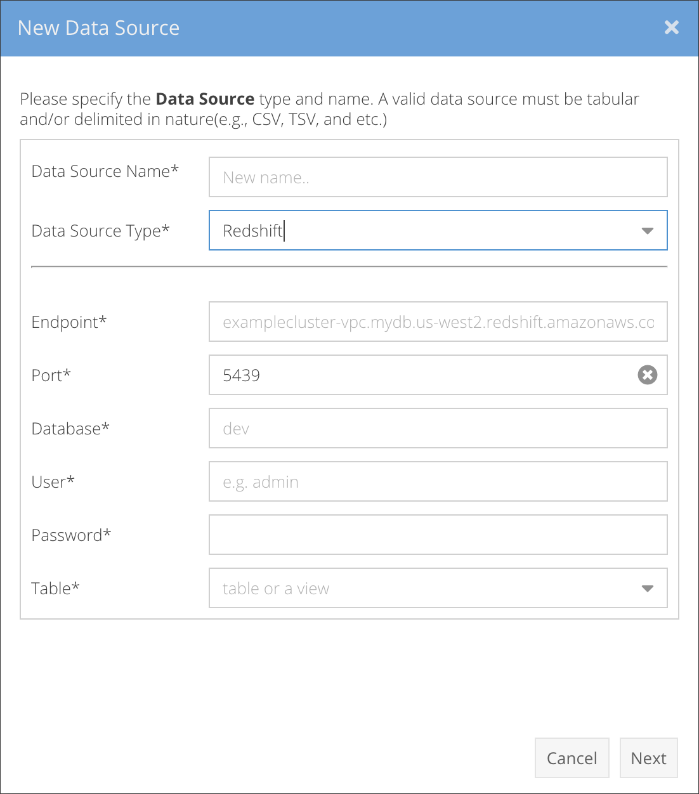
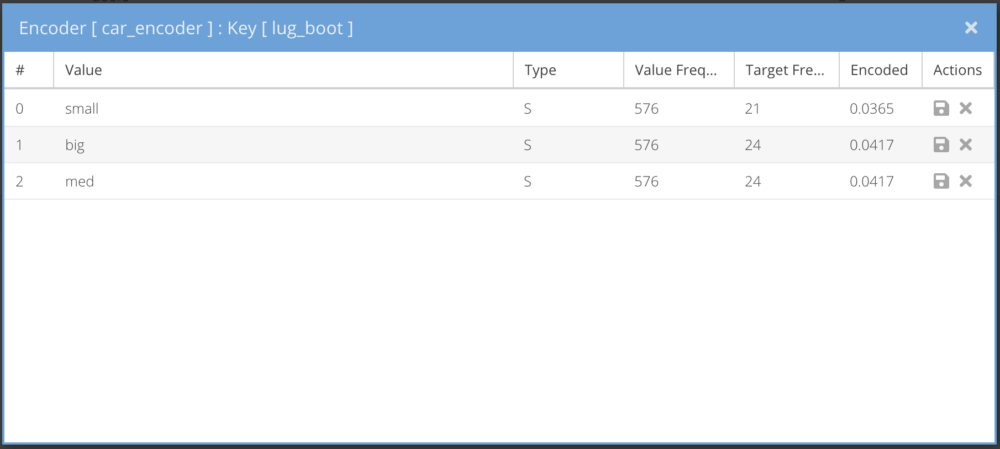

= Symetry Web - User Guide
:toc:
:toclevels: 2
:toc-placement: preamble
:doctype: book
// :imagesdir: .media/web

Copyright © 2020 by Symetry, Inc. +
14 Pine Street, Ste 6 +
Morristown, NJ 07960 +
All Rights Reserved +
April 27st, 2020

[[introduction]]
== Introduction

This user guide is intended for analysts using SymetryML in their next
data-mining project. While this document does not assume extensive
background in data modeling, the reader should have a rudimentary
understanding of data-mining methodology, as well as the necessary
domain knowledge related to their field of application.

A brief introduction to data-mining concepts will be provided in this
guide, along with instructions on applying these concepts to SymetryML
workflow. The core intention of this document is to provide readers
with a brief summary of the information needed to implement SymetryML
successfully into their data-driven projects and to cover typical usage
scenarios.

[[related-documents]]
=== Related Documents

While this guide provides an introduction to data-mining concepts and general 
guidance on navigationg SymetryML Web UI, more specific guides dealing with sequence data and
Federated Learning can be found here:

* <<SML_Sequence_Projects_and_Models.adoc#>>
* <<SML_FedML_User_Guide.adoc#>>

// For a brief introduction to data-mining concepts, as well as general guidance on navigating the SymetryML Web UI, please refer to <<SML_Web_User_Guide.adoc#>>.  

[[document-conventions]]
=== Document Conventions

This manual also uses the following typographic conventions.

[width="100%",cols="25%,75%",options="header",]
|=======================================================================
|*Convention* |*Description*
|*Bold* |Indicates text on a Web page, other than the page title, including
menus, menu options, buttons, fields, and labels.
|_Italic_ or < > angled brackets |Indicates a variable, which is a placeholder
for actual text provided by the user or system. Angled brackets (< >) are
also used to indicate variables.
|`screen/code` |Indicates text that is displayed on screen or entered by the user.
|[ ] square brackets |Indicates optional values.
|{ } braces |Indicates required or expected values.
| \| vertical bar | Indicates that you have a choice between two or more
options or arguments.
|=======================================================================

[[the-symetryml-difference]]
== The SymetryML Difference

SymetryML is an application that allows organizations to leverage their
existing data to gain further insight into their current business
processes. Whether you want to increase user clicks, select the most
appropriate product, or analyze the relationship between various factors
affecting your business, SymetryML can offer you a real-time, scalable,
and easy-to-deploy platform on which to build the next generation of
data-driven applications within your organization.

A unique feature of SymetryML is the adoption of the *online learning*
approach to predictive analytics. This is accomplished by separating the
learning phase from model creation. By avoiding the complete data scan
typically required by the majority of other systems, users are able to
experiment with many different models, using a varying selection of
attributes, and find the perfect combination of attributes for their
particular task. Separating learning and modeling also allows SymetryML
to account for new attributes dynamically, including increments and
decrements. Adding new attributes is simply a matter of feeding new data
into SymetryML. If at some stage the data is found to be erroneous,
removing these records from SymetryML becomes a simple operation.
Experimenting with large datasets becomes a much more fluid and less
time-consuming process, thus enabling faster deployments and a quicker
time-to-market.

[[the-data-mining-lifecycle]]
== The Data-Mining Lifecycle

[[overview]]
=== Overview

Data mining is about explaining the past and predicting the future using
data analysis. While the term is relatively new, the process of using
empirical data to gain further insight has been around long enough to
produce a well-defined methodology that guides the development of such
projects.

[[problem-definition]]
=== Problem Definition

Defining a data-mining problem requires a complete understanding of a
project’s objectives and requirements from a domain perspective, and
then converting that knowledge into a data-mining problem definition
with a preliminary plan designed to achieve the objectives. Data-mining
projects are often structured around the specific needs of an industry
sector or even tailored and built for a single organization.

A successful data-mining project starts from a well-defined question or
need. For example, a business might want to increase the click-through
rate (CTR) for its upcoming email campaign, or an insurance company
might want to classify customers into different risk categories. These
examples are precise enough to be formulated as a data-mining model with
a well-defined objective.

The next step is to gather historical data and adjust it to fit our
problem.

[[data-preparation]]
=== Data Preparation

Data preparation involves constructing a dataset from one or more data
sources to be used for exploration and modeling. Best practice requires
starting with an initial sample dataset to get familiar with the data,
to discover first insights into the data, and to have a good
understanding of any possible data quality issues.

Data preparation is often a time-consuming process and heavily prone to
errors. The old saying "garbage in, garbage out" is particularly
applicable to those data-mining projects in which data gathered may
contain invalid, out-of-range, or missing values. Analyzing data that
has not been carefully screened for such problems can produce highly
misleading results.

[[data-exploration]]
=== Data Exploration

Data exploration is the process of describing data using statistical and
visualization techniques. The data is explored in order to bring
important aspects of it into focus for further analysis.

SymetryML provides functionality for both _univariate_ analysis and
_multivariate_ analysis. Univariate analysis focuses on one attribute at
a time and is an easy way to verify that the data has been imported
correctly and is in line with the previous assumptions made by the
analyst. Multivariate analysis, on the other hand, allows for the study
of many attributes and the relationships between them. For example:

* Are certain attributes correlated?
* Do values of one attribute show statistical dependence on the values
of another?

These questions can generally be answered with the help of multivariate
analysis and will guide the attribute choice for the final model.

[[modeling]]
=== Modeling

Predictive modeling uses historical data to predict the probability of
an unknown event. If the unknown outcome is categorical in nature (for
example, click vs. non-click on a banner ad), you are solving a
_classification_ problem and will need to build a classification model.
In other words, you are trying to classify a particular case into the
most appropriate group.

A _regression_ model, on the other hand, attempts to predict the value
of a continuous variable. An example of this could be the average value
of a shopping cart on your site or average house price in a particular
area. In both cases, you use a set of input attributes (that is,
features and predictors) to model a particular dependent, target,
variable.

[[evaluating-models]]
=== Evaluating Models

Model evaluation is an integral part of the model-development process.
It aids in finding the best model that represents the process and in
presenting how well the chosen model will work in predicting future
outcomes.

A common approach to performing model evaluation is to separate the
historical data into two parts.

* The first part, often the larger of the two, will serve as the
training set. This part will be used to build the model.
* The remaining part, typically referred to as the test set, will be
left out until the model-building process is complete.

After the model is ready, its performance can be evaluated with this
test set. The outcomes for the test set are known in advance. Evaluating
the model simply involves keeping a tally of the number of times it
predicts the outcomes of the test set correctly.

[[deployment]]
=== Deployment

The concept of deployment in predictive data mining refers to the
application of a model for prediction of new data. Building a model is
generally not the end of the project. Even if the purpose of the model
is to increase knowledge of the data, the knowledge gained will need to
be organized and presented in a way that can be used.

Depending on the requirements, the deployment phase can be as simple as
generating a report or as complex as implementing a repeatable
data-mining process. In many cases, it will be developers, not data
analysts, who perform the deployment steps. However, even if analysts
perform the deployment effort, the developers must understand up front
what actions will be needed to use the created models. 

[[symetryml-key-concepts]]
== SymetryML Key Concepts

[[working-with-symetryml]]
=== Working with SymetryML

SymetryML offers users two ways to access its core functionality:

* SymetryML Web
* SymetryML REST

SymetryML Web offers a complete GUI for accessing the most common
functionality. It allows you to add data, learn, and build predictive
models on that data. Most functions available in SymetryML Web can be
replicated via individual service calls to SymetryML REST.

For a detailed description of SymetryML REST and how it can help you
simplify deployment, refer to the _SymetryML API Reference Guide._

[[authentication]]
=== Authentication

To access SymetryML Web functionality, you log in with a predefined set
of credentials. The process of generating these credentials is described
in __SymetryML Admin User Guide__.

[[symetryml-web-ui]]
=== SymetryML Web UI

After you log in to SymetryML Web, the SymetryML Web interface in <<id-sml-ui-panels>> appears. This interface allows you to fully leverage SymetryML
functions.

The interface is organized into three components:

* Main accordion
* Contextual panel
* User admin panel

Within these panels, you can interact with various SymetryML objects,
such as models, data sources, and encoders.

[[id-sml-ui-panels]]

.UI Panels
[width="100%",cols="17%,83%",options="header",]
|=======================================================================
|*UI Component* |*Description*
|User Admin |Shows the active user and the current version of the SymetryML
application. This panel also notifies you about version updates.
|Main Accordion |Provides a quick overview of data sources, encoders and current
projects.
|Contextual |Details about specific SymetryML objects can be viewed in a
contextual panel. For instance, double-clicking a learned project object shows
summary statistics, and allows you to perform hypothesis testing and analysis
of variance (ANOVA) exploration.
|Job Status |Provides information about the status of currently running jobs.
|=======================================================================

.UI Windows
[width="100%",cols="20%,80%",options="header",]
|=======================================================================
|*Panel* |*Description*
|Projects |Provides access to the heart of SymetryML: the Symetry project.
Here you can learn and explore new data, build and evaluate your models,
and make predictions.
|Data Sources |Expand to show a general overview of the data sources currently
registered with SymetryML. This allows you to validate and delete various data
sources used within your project.
|Encoders |Allows you to access additional information for the encoders you
might have created.
|Status |Lists jobs running on your SymetryML server.
|=======================================================================

[[data-source]]
=== Data Sources

The first step when working with SymetryML is to define a data source.
Data-source objects are typically flat text files stored at a remote
location. The remote location can be any of the following : SFTP, Amazon
S3, HTTP/HTTPS, JDBC, Redshift, and Spark S3.

The desired target attribute must be either binary or continuous.
Categorical target attributes should have their values recoded into
corresponding binary indicators.

After registering a particular data source with SymetryML, you have
everything you need to learn from the newly added data.

For more details on how create data source please refer to the 
<<working-with-data-sources>> section.

[[streams]]
=== Streams

Streams are a dynamic and constantly changing source of data. Unlike their flat file 
counterparts, streams do not have an end. As of now, SymetryML only supports Kafka Streams. 
More information about Kafka streams can be found https://kafka.apache.org/[here]. Please also consult
the <<working-with-streams>> section of this document.

Once associated with a particular project, streams enable the project to learn new data as
it becomes available  in a continuous  fashion without user interaction.

[[symetry-job]]
=== Symetry Job

Most interactions with SymetryML involve launching a background process
on the Symetry server. To view the currently running jobs and their
progress, click the *Job Listing* button.

Processor-intensive jobs often prevent other jobs from starting. This is
normal and helps ensure the running stability of the SymetryML server.

image::media/web/job_status_current.png[title='Job Status', width=50%]

[[encoder]]
=== Encoder

In data mining, the process of transforming a categorical attribute into
a continuous attribute is called _encoding._ Within SymetryML, an
encoder object allows you to transform high-cardinality attributes into
meaningful data points that are more predictive than their original
form. Because certain modeling algorithms have strict requirements for
the type of inputs they accept, an encoded attribute is more flexible in
nature than its categorical counterpart.

The current version of SymetrML supports two types of Encoders:

* Probabilistic Encoding - A method which replaces a categorical value _x_ with a 
probability value of positive target value given _x_, or `P(target=1 | X=x)`

* Feature Hashing - an implementation of the https://en.wikipedia.org/wiki/Feature_hashing[hashing trick] approach to encoding *String* values

[[project]]
=== Project

Within SymetryML, a project is a top-level container for a collection of
data files, models, prediction results, and assessment results. While no
particular convention is enforced, we recommend that the project contain
elements closely related to a particular data-mining initiative. In
practice, this means that each project should focus on a related set of
data.

Depending on your hardware, you could have up to five different project
types:

[[cpu]]
==== CPU

Computation is performed on the CPU. Most common choice for small to
medium sized data sets.

[[sequence]]
==== Sequence

Computation is performed on the CPU. Used for sequence data sets.

[[gpu]]
==== GPU

Available if the environment is GPU enabled. Computation is performed on
the GPU. Provides improved performance over CPU based projects with very wide datasets (i.e.large amount of features)

When creating a New Project, the first window will require a choice of Project Type. If you only have access to 1 GPU, simply select the `GPU` option, and select `Next`. If you have access to, and wish to utilize, more than 1 `GPU`, then select the `Multi-GPU` option, and then fill out the `Num. GPU*` that you will be utilizing: 

[[mgpu]]
==== Multi-GPU

Requires GPU enabled environment. Reserved for the widest possible datasets.
Multi-GPU projects cannot be persisted.

[[partition]]
==== Partition

Allows for a more specialized approach to learning your data. This is
done by partitioning the internal representation on the categorical column
of your choice. For multiclass classification problems, a partitioned project 
will generally produce more accurate representation. However, the improved 
performance does come at the price of additional memory overhead. 
As a rule of thumb, partitioned project will take up *N* times
more memory as their CPU/GPU counterparts, where *N* is the cardinality
of the partion column.

.Suggested Project Type
[cols=",",options="header",]
|====================================
|*Use Case* |*Suggested Project Type*
|Sequence/Temporal |Sequence
|1 to 250 Attributes |CPU/Partition
|250 to 10,000 Attributes |GPU
|10,000+ |Multi-GPU
|====================================

[[exploration]]
=== Exploration

After data is added and learned, use SymetryML Web’s explore feature to
verify that your project has been processed correctly. In other words, a
project becomes _explorable_ after a data source has been added to it
and learned. Using univariate and bivariate analyses, you can determine
the likely selection of candidate pairs that will provide insight for
model building. Within SymetryML Web, tools for exploratory analysis are
accessed via tabs in the contextual panel.

*Auto Refresh* functionality will ensure that your web client will
always be synced with the state of the project on the SymetryML Server.
This feature can be disabled to improve performance for projects with
large number of attributes.

The *Univariate* panel shows the basic statistics for attributes
from a particular data source. View this information as a quick sanity
check to validate whether SymetryML interpreted the data correctly.

The *Correlation* panel allows you to perform bivariate analyses
on the learned data. This enables you to learn quickly about the degree
of associativity between your variables and helps when creating
subsequent models. In general, avoid models with highly correlated input
variables. For example, if variable A is highly correlated with variable
B, choose only one for the final model.

*Hypothesis testing* provides a formal way to determine the
effect of various inputs on your continuous target. Using this testing,
you can determine whether the difference in the continuous variable is
related to the values of the binary variables, or test the difference between 
groups of continuous variables.

Like a correlation analysis, hypothesis testing is a way to perform a
bivariate analysis and assess how variables interact. It is best used to 
determine if the difference in mean/variance between two groups is stastically
significant. For cases where you need to look at the difference between more
than two groups, please refer to our section on ANOVA.

Each test can be specified in the following fashion:
* the average/variance of a numerical attribute with a known average/variance
* average/variance of two numerical attributes against each other
* two conditional averages of a numerical attribute given one binary attribute
* two conditional averages of a numerical attribute given two binary attributes

The *Z Test* assesses whether the difference between the averages of two
groups is statistically significant.

The *T Test*, like the Z Test, assesses whether the averages of two
groups are statistically different from each other when
the number of data points is less than 30.

The *F Test* compares the variances of two groups. 

*Analysis of variance (ANOVA)* assesses whether the averages of
more than two groups are statistically different from each other, under
the assumption that the corresponding populations are normally
distributed. Use ANOVA to compare the averages of two or more numerical
attributes, or two or more conditional averages of a numerical
attribute, given two or more binary attributes (two or more categories
of the same categorical attribute).

The *Chi-square Test* determines the association between two or
more categories. This test compares the difference between the expected
contingency table and the observed one to determine the strength of the
association between the two categories of interest. The output of a
chi-squared test is a probability value that corresponds to the level of
association. A p-value that is very close to zero corresponds to a
strong dependency between the two categories, while a higher p-value
implies a certain degree of independence.

With the help of the *SVD* panel, you are able to
perform _Singular Value Decomposition_. This allows you to select potential attributes of interest when
you actually want to build a model.

The *Principal Component Analysis (PCA)* identifies the most
important components of a given dataset and maps the raw observations
onto this new vector space. Variable importance can be inferred by
looking at the Eigen vectors generated by this transformation.

Within SymetryML**,** use PCA shortly after the project completes
learning:

1.  Click the *PCA* tab.
2.  Select the attributes of interest.
3.  Click the *PCA* button.

*Information Gain* is a metric that measures the change in information
entropy for a specific attribute. In the context of SymetryML, use
information gain to find attributes that will provide the best
separation for your particular target of interest. Variables with high
information gain relative to your target will generally be better
predictors than their counterparts with low gain. For example, the following figure (<<id-sml-information-gain>>) shows
that values of attributes characterizing _petal width_ play the most important factor in
identifying the _Iris Setosa_ species of the Iris plant.

[[id-sml-information-gain]]

[[models]]
=== Models

Unlike most data-mining toolkits, SymetryML separates the tasks of
learning and model building into two discrete steps. The classical
approach assumes these two steps are synonymous by defining model
building within the actual learning phase. SymetryML achieves this
separation by scanning the input data in such a way as to defer model
creation to a later stage. This allows SymetryML to reduce the memory
footprint required to learn large data sets and allows models to be
created instantaneously. After the data has been learned, SymetryML can
generate classification and regression models.

[[using-classification-models]]
==== Using Classification Models

_Classification_ refers to the data-mining task of trying to build a
predictive model when the target is categorical. The main goal of
classification is to organize a dataset into mutually-exclusive groups,
so that the members of each group are as close to one another as
possible, and different groups are as far from one another as possible.

Types of classification models include:

* LDA - linear discriminant analysis.
* LSVM - linear support vector machine.
* Bayes - Naïve Bayes.

If the project is partitioned (i.e., split on a particular column), two
additional model types become available:

* MetaLDA
* MetaQDA

These models handle the multi class classification problem more gracefully
than their regular counterparts and are generally more accurate.

[[using-regression-models]]
==== Using Regression Models

_Regression_ refers to the data-mining problem of attempting to build a
predictive model when the target is numerical. The simplest form of
regression, simple linear regression, fits a line to a set of data.

Types of regression models include:

* MLR - multi-linear regression.
* LSVR - linear support vector regression.

[[using-sequence-models]]
==== Using Sequence Models

A *Markov Chain* (MC) is a graphical representation of a sequence of
states and the relationship among them. At its most basic, a MC model
will tell us the probability of transitioning to one state from another.

Like the MC a *Hidden Markov Model* (HMM) is a graphical model
describing the probabilities of transitioning from one state to another.
It extends the Markov process by focusing on two states: observed and
hidden. The observed states, as their names imply, are the states that
are visible at any given time. While hidden states are not visible
directly, the user knows of their existence. The most common use case
for HMM is to infer the sequence of underlying hidden states given a set
of visible states.

[[reducing-models]]
==== Reducing Models

SymetryML can reduce models automatically to find one with the best
subset of attributes. This is useful when working with datasets that
have many attributes. SymetryML uses a heuristic to build various
models, compares the models, and keeps the best one. This comparison is
performed efficiently by using the intrinsic values of the models.

Not all modeling algorithms are suited for this type of intrinsic-value
comparison. These techniques work only when building LDA and MLR
algorithms.

[[generating-new-predictions]]
=== Generating New Predictions

After the models are created, they can generate new predictions. Like
many SymetryML functions, predictions can be performed through a RESTful
API provided by SymetryML REST service or with the SymetryML Web
application.

[[assessing-the-accuracy-of-a-model]]
=== Assessing the Accuracy of a Model

After you create your project, data has been added and learned, and the
model has been built, you can test the accuracy of the model by entering
historical data that was not used during the learning. You can then
proceed to “hide” the correct value of the target attribute from the
model and have the model predict the outcome. By comparing the answer
provided by the model with the actual result, and counting the number of
times the model made the correct guess, you can assess the accuracy of
the model. Using SymetryML Web, you can perform this type of assessment
easily for most models.

For classification models with binary targets, feeding labeled data into
SymetryML generates a confusion matrix and gain chart that can be used to assess 
the performance of the models. Assessment of multi-target (for example, QDA)
models yields a multi-class confusion matrix.

Assessing a regression model yields a distribution of errors along with
standard regression metrics such as Root Mean Squared Error (RMSE) and
Mean Absolute Error (MAE). For more information, see section <<assessing-model-performance>>.

[[using-symetry-web]]
== Using Symetry Web

[[authentication-1]]
=== Authentication

Authentication with the SymetryML application is achieved using a
predefined user ID and security key. The randomly generated
security key was given to you when you initially registered for the
application.

[[id-login-screen]]

If this is your first time registering, use the user ID *admin* and user
secret key **admin**. Click **Sign In**. The system redirects you to the
registration section of Symetry Web that will guide you through the
registration process.

[[working-with-data-sources]]
=== Working with Data Sources

[[creating-new-data-sources]]
==== Creating New Data Sources

To create a new data source:

1. Open the *Data Sources* accordion and click the *Add Data* button. A New Data
Source wizard appears.
2. Select the preferred **Data Source Type**. The wizard forms change, depending
on the type selected, as shown in the following figures.
+

+
image::media/web/sftp_ds.png[title='SFTP Data Source', width=50%]
+

+
image::media/web/jdbc_ds.png[title='JDBC Data Source', width=50%]
+
image::media/web/spark_ds.png[title='Spark Data Source', width=50%]
+

3. Ensure your data source settings are valid.
4. Click *Finish* to add the data source.
+
image::media/web/verify_new_data_source.png[title='Verify New Data Source', width=50%]

[[uploading-data-source]]
==== Uploading Data Source

Files on local to the client’s machine can be uploaded onto a SFTP
server via the Upload Wizard. This can be done by selecting a
destination source and selecting a local file from the user’s computer.

[[viewing-data-sources]]
==== Viewing Data Sources

To view your newly created data source:

1.  Double-click the data source node under the *Data Sources*
accordion.
2.  Inspect your newly added data.

[[id-data-preview]]
image::media/web/data_source_preview.png[title='Data Source Preview', width=100%]

[[deleting-data-sources]]
==== Deleting Data Sources

To delete a data source:

1.  Right-click the *Data Source* node, and then click *Delete*.
+
image::media/web/data_source_delete.png[title='Data Source Deletion', width=50%]

[[editing-data-sources]]
==== Editing Data Sources

To edit a data source:

1.  Right-click the *Data Source* node, and then click *Edit*.
2.  Update the fields as appropriate, and then click *Next* to continue.
3.  After validating your data source, click *Finish* to commit the
changes.
+

[[working-with-streams]]
=== Working with Streams

Unlike other Data Sources, streams cannot be created independent of a project.
The option to add a stream only exists when you:

* Have an existing SymetryML project
* Create a new SymetryML project from scratch

In both cases, creating a stream would require you to specify at minimum 
the following information:

* *Bootstrap Servers*
* *Schema Registry*
* *Kafka Topic*

*Time btw. Persists* is an optional parameter that controls the frequency at which
SymetryML persists a project with a stream. Default value of 300 seconds, should be sufficient
unless your schema contains a large number of attributes (1000+).

*Start from Beginning* checkbox would read the earliest possible data from the stream.
Unselecting this option would only update the project with the data that will be generated
from this point in time.

Advanced Kafka parameters could be enabled specified by clicking the *Kafka Options* button
and adding the corresponding parameter/value pair.

[[creating-project-add-stream]]
==== Adding a Stream to an existing Project

1. Right-click the project node, and then click *Add Stream*.
2. Specify the required stream info (bootstrap servers, topic, and etc.)
3. Ensure your information is valid and click *Next*
4. Verify the stream in the preview panel. Click *Next* to continue.
5. In the final panel specify the correct type mapping and click *Finish*

[[creating-new-project-stream]]
==== Creating a Project with Stream

When creating a new project, adding a stream can be performed by simply:

1. Selecting *New Data Source* on the data selection panel
2. Specifying the required stream info (bootstrap servers, topic, and etc.)

See <<creating-new-projects>> for more information.

==== Stoping and Restarting a Stream

Once added to a project, a stream will be continuously polled and will cause the 
project to be updated automatically with new incoming data. This behavior  can be 
paused and restarted again.

image::media/web/stream_options.png[title='Stream Info', width=50%]

To stop the update behavior:
1. Right-click on the stream node 
2. Click *Stop Stream*

While this does stop the project from being update, it has no effect on the underlying stream.
The Kafka Stream will continue to ingest  new data in the background.

Resuming project update behavior  can be done in one of two ways:

* A stream can be resumed from the point where it was paused (*Resume Stream*)
* It can be restarted from the very beginning. (*Start from Beginning*)

The correct restart point will depend on the architecture of your Kafka cluster.
If the cluster allows for storage of large volume of data, simply resuming might 
be the best option. On the other hand, if the data in the cluster is changing
rapidly, restarting from the beginning might be more optimal.

==== Stream Metrics

Information about a Kafka Stream can be obtained by right clicking on the stream node
and selecting *Stream Metrics*

image::media/web/stream_metrics.png[title='Stream Metrics', width=50%]

==== Stream Errors

*Error Log* allows the user to diagnose any potential problems that might occur
when interfacing with a Kafka Stream. This is the first place you should look when 
troubleshooting.

[[working-with-encoders]]
=== Working with Encoders

[[creating-new-encoders]]
==== Creating New Encoders

To create a new encoder:

1.  Expand the *Encoders* accordion, and then click the *New Encoder*
button. A *New Encoder* wizard appears .
+
image::media/web/new_encoder_wizard.png[title='New Encoder Wizard', width=50%]

2.  Assign a new name to your encoder, and then click *Next* to
continue.
3.  Select an appropriate data source, and then click *Next* to
continue.
4.  Ensure that your data is valid, and then click *Next* to
continue.
+
[[id-encoder-ds-valid]]
image::media/web/encoder_data_preview.png[title='Encoder Data Preview', width=50%]

5.  Select the appropriate target variable.
6.  Click *Finish* to build the encoder.
+
[[id-encoder-target]]
image::media/web/encoder_target_mapping.png[title='Encoder Target Mapping', width=50%]

[[viewing-encoder-metadata]]
==== Viewing Encoder Metadata

To view the metadata for an encoder:

1.  Double-click the encoder node.
+
[[id-encoder-tree]]
image::media/web/encoder_tree.png[title='Encoder Tree', width=50%]

[[editing-encoders]]
==== Editing Encoders

After you create the encoder, you can modify its internal state to
satisfy your needs.

1.  Under the encoder metadata view, double-click the desired encoder
**Key**. The key editor appears.
2.  Use the key editor to modify the *Total Count* and *Sum* values
+
[[id-encoder-editor]]

[[deleting-encoders]]
==== Deleting Encoders

To remove an encoder from your project:

1.  Right-click the encoder node, and then click *Delete*.
+

[[adding-data-sources-to-encoders]]
==== Adding Data Sources to Encoders

To add data sources to an encoder:

1.  Right-click the encoder node, and then click *Add Data*.
+
image::media/web/sml_encoder_add_data.png[title='Adding a Data Source to an Encoder', width=50%]

[[working-with-projects]]
=== Working with Projects

[[creating-new-projects]]
==== Creating New Projects

Project creation is one of the first steps in performing data analysis
within SymetryML. As a user you also have the option of deciding whether
the project should be persisted. Disabling persistence will improve the
responsiveness of the application but your data will not survive a
system reboot. To create a new project:

1.  Expand the *Projects* panel, and then click the *Create Project*
button.
2.  Select the appropriate project type.
3.  Assign a new name to your project, optionally assign an
encoder to your project or select the order of the sequence. Click
*Next* to continue.
+
image::media/web/new_project_start.png[title='New Project', width=50%]

4.  Select an existing data source or define a new data
source directly from the project wizard.
+

5.  Ensure that your data is valid.
+

6.  Click **Next**. The type-mapping panel appears.
7.  On the type-mapping panel, verify the data types for the attributes
inside the file. You can change the data types to ones that are more
appropriate. Click *Finish* to start the project-creation task.
+
image::media/web/project_type_selection.png[title='Type Selection', width=50%]

8.  After the project creation completes, the change is shown in the
project tree.
+
image::media/web/project_tree2.png[title='Project Tree', width=50%]

[[exploring-projects]]
==== Exploring Projects

After you create your project, you can access to multiple forms of
univariate and bivariate methods of analysis.

1.  Double-click the *Exploration* icon in the project tree.
2.  Click the tab corresponding to the task you want to perform.

[[adding-data-to-projects]]
==== Adding Data to Projects

You can augment an existing project with additional data at a later
time. For example, you can use this feature with an output of a weekly
ETL process that constantly updates the file for use within SymetryML.

1.  Right-click the *Exploration* node of your project tree.
2.  Click *Add Data.*
+
image::media/web/sml_add_data.png[title='Project Tree Add Data', width=50%]

3.  Specify whether you are using an existing or new data source, and
then click *Next* to continue.
4.  Inspect your data to ensure it was read properly. Click *Next* to
add the data to your project.

[[learning-and-forgetting]]
==== Learning and Forgetting

After you add a new data source to your project, you can either learn
from this data or forget the records.

* To learn a newly added data source, right-click the data-source node
in the project tree, and then click *Learn*.

* To forget a data source, right-click the data source node in the
project tree, and then click *Forget*.

[[renaming-projects]]
==== Renaming Projects

You can rename a project at any time.

1.  Expand the *Projects* accordion. Right-click the exploration node,
and then click **Rename Project**.
2.  Enter the new name, and then click *OK* when finished.

[[merge-projects]]
==== Merging Projects

Two projects can be merged. This process involves transfering all the learned data
from the source project into a destination project. To perform a project merge:

1.  Right click on the destination project icon.
+

2.  Select **Merge Project** from the contextual menu.
3.  After the *Merge Project* wizard appears, select the source project.
+

4.  Click **Finish**

The destination project will now be updated with the metadata of the source project.

[[deleting-projects]]
==== Deleting Projects

If you no longer need a project, you can delete it. When you delete a
project, all accumulated metadata and models related to the project are
also deleted. However, associated data sources and encoders will still
be available.

1.  Expand the *Projects* accordion. Right-click the project node, and
then click **Delete**.

[[detaching-data]]
==== Detaching Data

Data can be detached from a given project. Note, this will not “unlearn”
the data source. It simply disassociates the data from the project.

[[managing-memory]]
==== Managing Memory

SymetryML Projects are permenantly persisted inside a fast access in-memory database. However, direct interaction with the Projects, either though learning, modeling building or prediction, requires the Project to be loaded into the memory of the JVM process. 

Overtime, as the number of projects grows, the physical memory of the machine hosting the SymetryML process will become exhausted. In this case, it becomes necessary to manually manage the memory consumption of the JVM process.

Within the SymetryML Web UI, you are able to unload the chosen project and reduce the physical memory requirements of the SymetryML process.

Unloaded project will be displayed as the lighter version of its in-memory counterparts.
Loading the project back into JVM memory can be performed by either double-clicking on the corresponding icon,
or right-clicking and selecting *Load Project*.

[[working-with-models]]
=== Working with Models

After you create a project, you can build models. Using models, you can
leverage the historical data learned within the project to make
predictions about the future.

[[creating-new-models-accordion]]
==== Creating New Models - Main Accordion

To create a new model:

1.  Right-click the *Exploration* icon in the project tree, and then
click the appropriate model for you needs.
+

+
image::media/web/meta_model_create.png[title="Create Model - Partition Project", width=50%]
+
NOTE: Partioned projects allow you to create two additional types of models:
MetaLDA and MetaQDA. For more information see
<<using-classification-models>>
+
The Create Model Wizard appears.
[[id-create-model]]
image::media/web/create_model.png[title='Create Model Wizard', width=50%]

2. Assign a new name to the model. Certain models allow for additional
options relating to feature selection and model
reduction . Furthermore, because these models rely heavily on
matrix inversion, the user is able to adjust the sensitivity of such
operations via Reciprocal Condition Number Threshold. Note, this feature
is for advanced users only
3.  Check the attributes you want to use as inputs and targets.
Click *Build Model* to continue.
+

+
image::media/web/hmm_model_role_selection.png[title='Model-Role Selection (Sequence)', width=50%]

4.  After completing the model-building process, the wizard prompts you
about whether you want to see the results. Click *Yes* to view
information about your new model.
+

// ==== Creating New Models - Exploration
// The *Exploration Panel* provides an alternative way of creating models

// image::media/web/explore_model_create.png[title='Model Create', width=50%]

// . Highlight the columns you wish to use as your input attributes.
// . Right-click on the contextual panel.
// . Select the appropriate model type

// NOTE: This option is only available in : *Univariate*, *Correlation*, *PCA*,
// *SVD*, and *Information Gain* panels

[[clone-model]]
==== Clone Model

Models within a particular class (i.e., Classification or Regression)
can be cloned, rebuilt, with a different algorithm by simply selecting
the preferred algorithm within the model info view.

image::media/web/model_clone.png[title='Model Clone', width=50%]

[[sequence-models]]
==== Sequence Models

Sequence models, unlike their classification and regression
counterparts, require the project to be constructed as a sequence
project from the start.

[[viewing-model-metadata]]
==== Viewing Model Metadata

Once the model is built, you can double click on the corresponding model
icon in the projects view and see the associated metadata.

The type of information displayed is dependent on the class of model.

[[refining-lda-models]]
==== Refining LDA Models

LDA models have a special property that differentiates them from other
algorithms. They can be refined, or updated, in real time. This means
you can add or remove attributes as you see fit and the model will be
rebuilt instantly. To refine a model, select the *Input Attributes* you
want to add and remove the ones you want to remove.

image::media/web/refine_model.png[title='Example of Refining a Model', width=100%]

[[deleting-models]]
==== Deleting Models

To remove a model:

1.  Right-click the model node, and then click *Delete Model*.
+

[[assessing-model-performance]]
==== Assessing Model Performance

You can assess the performance of most models (excluding MC) using a
labeled file.

1.  Right-click the model node, and then click *Assessment*.
+

2.  Specify the input data source you will use for the assessment, and
then click *Next* to continue.
3.  Verify the data source you added, and then click *Next* to continue.
4.  Ensure that your model’s target variables are mapped to the target
variables of your file.
+

5.  Click *Finish* to start the assessment process.
6.  After the assessment process finishes, a dialog asks whether you
want to see the assessment results. If you click **Yes**, the assessment
information panel appropriate for your model type appears (see the
following figures).

* Simple binary classification models show a confusion matrix with lift
curve information.
* Regression models show a distribution of errors curve in addition to
RMSE and MAE.
* Multi-target classification models show a descriptive confusion
matrix.
+

+
image::media/sequence/sml_hmm_assess_5.png[title="Assessment Result", image,width=50%]
+
image::media/web/assessment_regression.png[title='Regression Assessmenttitle', width=50%]

[[using-a-model-for-predictions]]
==== Using a Model for Predictions

In addition to performing an assessment, you can use an existing model
for predictions against a file.

1.  Right-click the model node, and then click *Predict*.
+

2.  Specify the input data source, and then click *Next* to continue.
3.  Specify the output data source, which is the location where you want
your predictions saved. Click *Next* to continue. A preview of the input
data source appears.
4.  Verify that the data source has been read correctly, and then click
*Next* to continue.
5.  Ensure the types in the data source match those of the model. Click
*Next* to continue.
6.  After the prediction process completes, a sample of the prediction
result appears. To download the entire prediction file, click the
*Download* button.
+
image::media/web/prediction_export.png[title='Prediction Export', width=100%]
